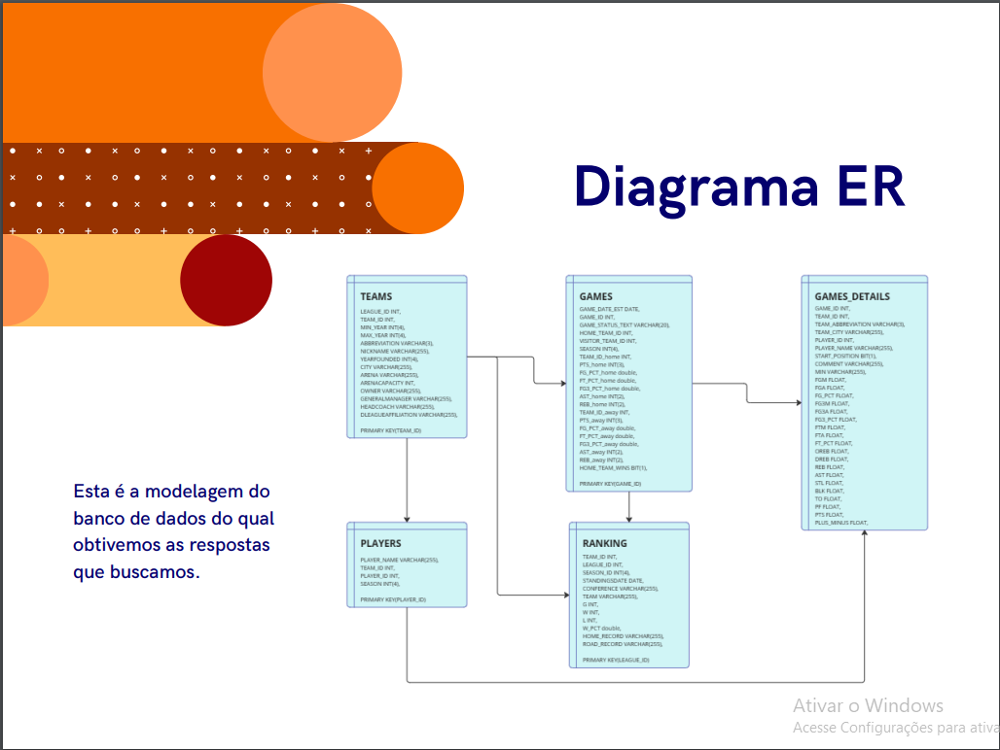
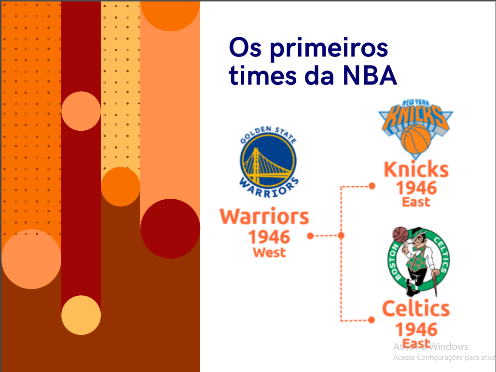
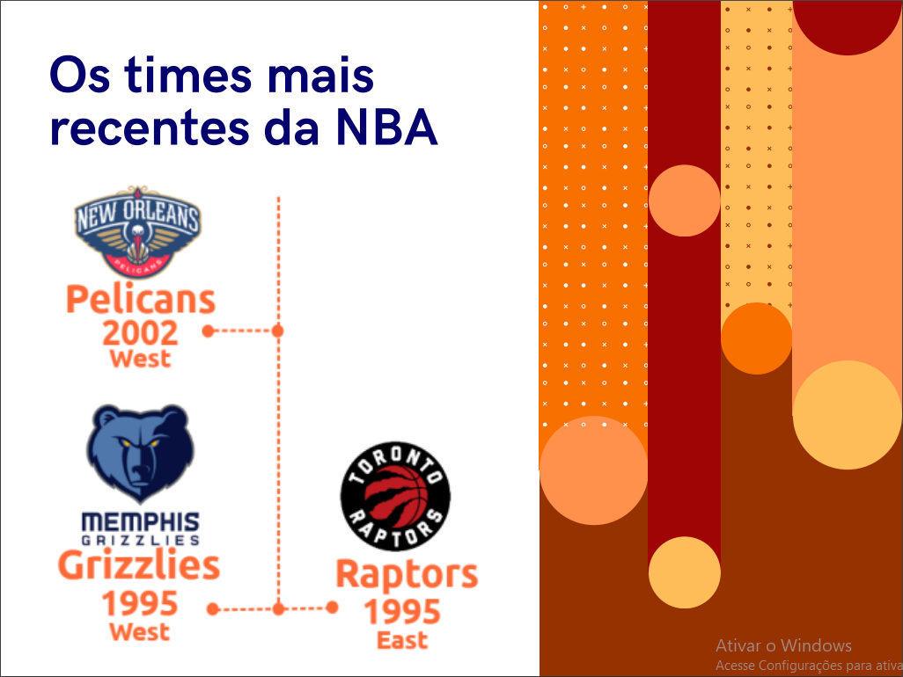
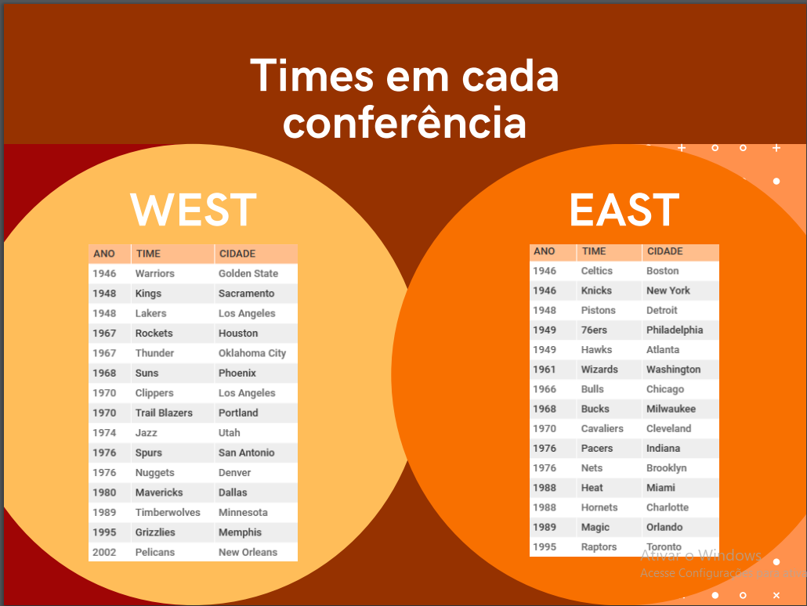
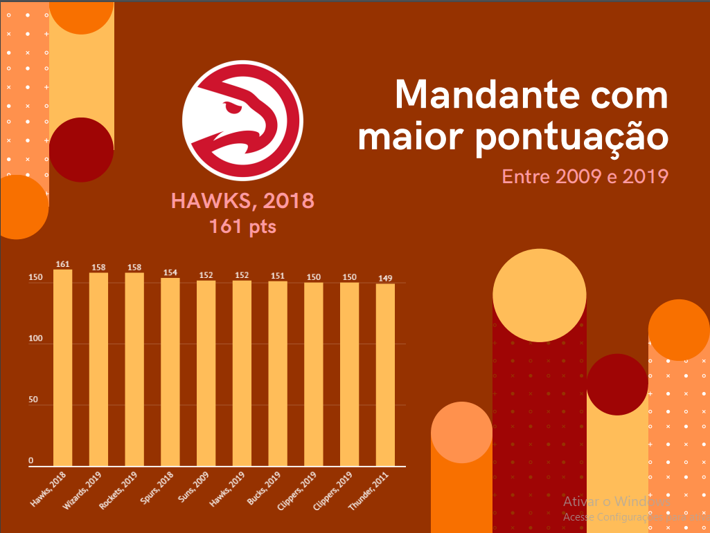
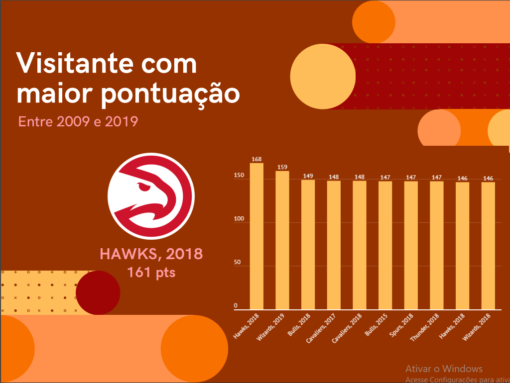

# Projeto_Modulo_04: NBA 

<h2 id="sobre">Sobre </h2>

Projeto do Módulo 04 do curso Resilida/Senac Educação. Abrange o trabalho com bancos de dados e o uso do MySQL para criar e resolver problemas com um banco de dados de sua escolha. O projeto também precisa atender aos seguintes objetivos:

- Construa o esquema do banco de dados: com base na avaliação do conjunto de dados fornecido, as tabelas do banco de dados são modeladas. Observe que não é necessário mapear todas as colunas de todas as tabelas. Simplifique sua implementação criando um modelo para responder às perguntas que seu grupo faz.
- Carregue o banco de dados: De acordo com o esquema projetado e criado, carregue os dados presentes no arquivo para o banco de dados para verificar o funcionamento da solução encontrada
- Perguntas de ideação/brainstorming que os dados podem responder: Analise o conjunto de dados selecionado para tornar as perguntas relevantes.
- Crie visualizações de dados com base nas perguntas feitas no sprint.
Monte uma apresentação com base em perguntas e análises exploratórias realizadas em conjuntos de dados selecionados.

 

<h2 id="linguagens">Linguagens & Ferramentas utilizadas no projeto :books:</h2>

  - [x] MySQL XAMPP
  - [x] Git
  - [x] Miro
  - [x] Excel

<h2 id="gráficos">Gráficos Estatísticos do Projeto :bar_chart:</h2>

##

*Consulte a documentação do GitHub em* 

## Link do repositório:
xxxxx

 

<h2 id="autores">Autores :male_detective: :female_detective:</h2>

  - [Amanda Cardoso](https://github.com/Acardioli9)
  - [Jordan Lima](https://github.com/jordanlima1)
  - [Juliana Jesus](https://github.com/JulianaJesus93)
  - [Luan Carlos](https://github.com/LuanCarlozZ)
  - [Pallone Silva](https://github.com/Pallone16)
  

  
